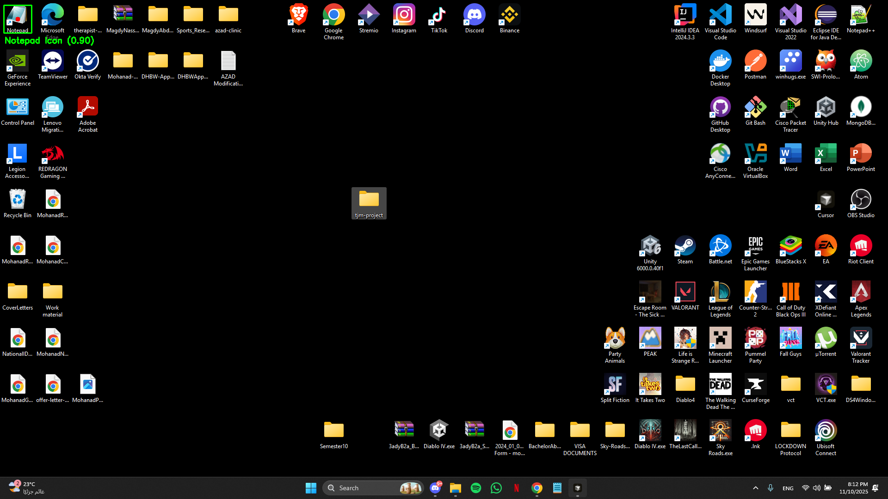
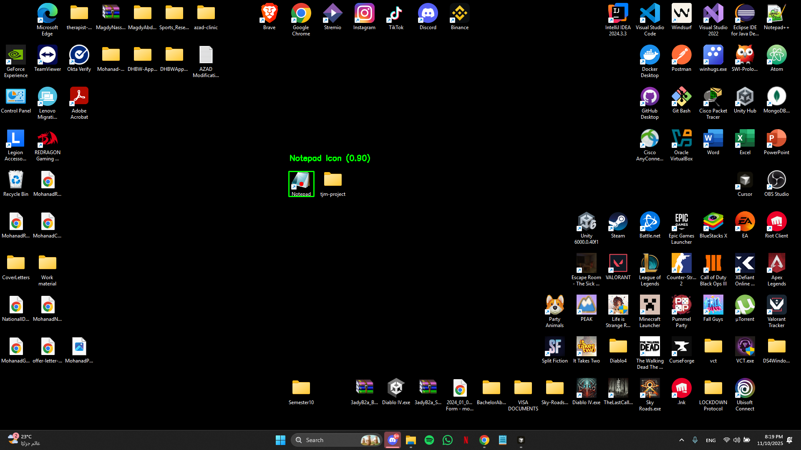
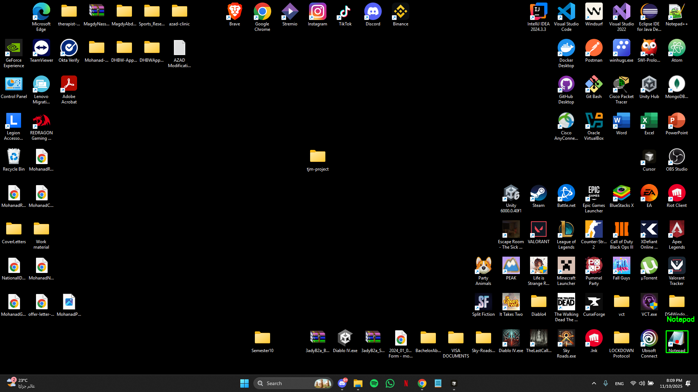

# Vision-Based Desktop Automation

A Python tool that automatically finds and interacts with desktop icons using computer vision. The system can detect the Notepad icon anywhere on your screen, open it, and automate text entry tasks.

## Icon Detection Examples

The system successfully detects icons in different screen positions:

### Top-Left Position


### Center Position


### Bottom-Right Position


## What It Does

The script automatically:
- Detects the Notepad icon on your desktop using OCR and image processing
- Opens Notepad by double-clicking the detected icon
- Fetches blog posts from JSONPlaceholder API
- Types each post into Notepad and saves it as a text file

## Libraries Used

The project uses several Python libraries to make this work:

- **PyAutoGUI** - Captures screenshots and controls the mouse/keyboard to click icons and type text.
- **OpenCV (cv2)** - Processes screenshots to improve text detection. It converts images to grayscale, enhances contrast, and removes noise to make icon labels easier to read.
- **Pytesseract** - Performs OCR (Optical Character Recognition) to find the "Notepad" text on the desktop.
- **Requests** - Fetches blog posts from the JSONPlaceholder API.
- **PyGetWindow** - Verifies that Notepad opened successfully by checking for its window.

## Setup

### Install Dependencies

Using `uv` (recommended):
```bash
uv sync
```

Or with pip:
```bash
pip install -r requirements.txt
```

### Install Tesseract OCR

Tesseract is required for text detection:

1. Download from: https://github.com/UB-Mannheim/tesseract/wiki
2. Install it (usually goes to `C:\Program Files\Tesseract-OCR`)
3. Make sure it's in your system PATH

## Usage

Run the automation:

```bash
python -m src.main
```

The script will:
1. Capture a screenshot of your desktop
2. Process the image to detect the Notepad icon
3. Click the icon to open Notepad
4. Fetch 10 posts from the API
5. Type each post into Notepad and save it

Output files are saved to `Desktop/tjm-project/` and annotated screenshots showing detection results are saved to `Desktop/tjm-project/detection_screenshots/`.

## How It Works

The system uses OCR-based detection:

1. **Screenshot Capture** - Takes a picture of your desktop
2. **Image Preprocessing** - Converts to grayscale, removes noise, and increases contrast using OpenCV
3. **Text Detection** - Uses Tesseract OCR to find "Notepad" text labels on the desktop
4. **Position Calculation** - Estimates icon position based on where the text was found
5. **Automation** - Clicks the icon and performs the required tasks

## Project Structure

```
├── src/
│   ├── main.py            # Main entry point
│   ├── icon_detector.py   # Icon detection logic
│   ├── automation.py      # Mouse/keyboard automation
│   ├── api_client.py      # API interactions
│   └── utils.py           # Helper functions
└── output/                # Saved files and screenshots
```

## Requirements

- Windows desktop (tested on Windows 10/11)
- Python 3.8+
- Tesseract OCR installed
- A Notepad shortcut on your desktop

## Contact

mohannadnasar99@gmail.com
